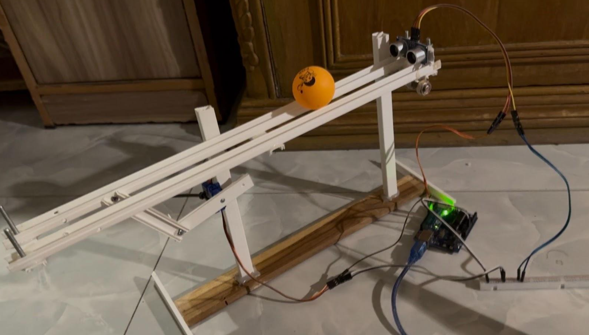

# PID BASED CONTROLLER 

The following project is a Ball and Beam System Based PID controller.

## Code

Click the following link to directly download the file from [drive](https://drive.google.com/drive/folders/1Mt04hyl1pCcOXk2DZd40gOuwkiQ3Hsvm?usp=sharing) & upload to your arduino.

```bash
idk do something
```

## Build Quality

This shi just balances the ball.


## 😝 YouTube Video

Watch this [video](https://youtu.be/h513nVM-t9g) !!

## Contributing

Pull requests are welcome. For major changes, please open an issue first
to discuss what you would like to change.

And I am newbie soo any sort of suggestions are welcome


## License

Idk i have a driving license 
